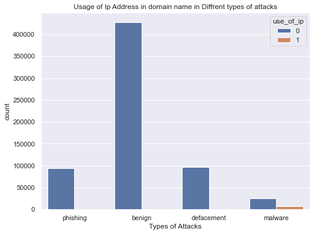

# Capstone Project: Malicious URL Detection

This repository contains the Jupyter Notebook and a detailed README for my capstone project on Malicious URL Detection. The project focuses on building and evaluating a machine learning model to classify URLs into different categories, primarily distinguishing between benign and various types of malicious URLs.

---

### Executive Summary

**Project Overview and Goals:**
This project aims to develop a robust classification model capable of identifying and categorizing malicious URLs. Leveraging a comprehensive dataset of URLs labeled across several types (benign, phishing, defacement, malware), the primary goal is to build a deep learning model, specifically a Convolutional Neural Network (CNN), that can accurately predict the nature of a given URL. The ultimate objective is to contribute to cybersecurity efforts by providing a tool for early detection and prevention of web-based threats.

**Findings:**
Initial exploratory data analysis revealed a significant imbalance in the dataset, with a large majority of URLs being benign. Phishing and defacement URLs constituted the next largest categories, followed by a smaller proportion of malware URLs. Word cloud visualizations highlighted distinct patterns in the vocabulary used within different URL types, suggesting that lexical and structural features of URLs are strong indicators for classification. The final model achieved a high overall accuracy of over 95%, with strong performance on the majority classes, while also demonstrating the challenges of classifying minority classes like `malware` and `defacement`.

**Results and Conclusion:**
The Convolutional Neural Network (CNN) model demonstrated promising capabilities in classifying URLs. The `CNN1D` architecture, designed to process sequential URL data, effectively learned intricate patterns from the URL strings. Initial evaluation on a hold-out test set indicated strong performance, with the model achieving an accuracy of over 95%. While the model performed exceptionally well on the majority `benign` class, challenges were noted with the minority `malware` and `defacement` classes, where precision and recall scores were slightly lower due to the class imbalance. The project concludes that deep learning, particularly CNNs, offers a powerful and proactive approach to combat malicious URLs by learning complex patterns that traditional methods might miss, and that future work should address the class imbalance to further improve performance on all categories.

**Future Research and Development:**
Future work could involve exploring more advanced deep learning architectures (e.g., LSTMs, Transformers) or hybrid models to potentially improve accuracy and generalization, especially for minority classes. Incorporating real-time URL features (e.g., WHOIS data, domain age, SSL certificate status) could enhance the model's predictive power. Additionally, investigating explainable AI (XAI) techniques would provide insights into the model's decision-making process, fostering trust and enabling better threat intelligence.

**Next Steps and Recommendations:**
The immediate next steps include a thorough evaluation of the model on unseen test data to provide concrete performance metrics (accuracy, precision, recall, F1-score for each class). Following this, deploying the model as an API service would allow for integration into web security tools or browser extensions. Regular retraining with updated datasets is crucial to adapt to evolving threat landscapes and to address potential concept drift in malicious URL patterns.

---

### Rationale
The proliferation of malicious URLs, particularly those associated with phishing, malware distribution, and website defacement, poses a significant threat to internet users and organizations. Traditional detection methods often rely on blacklists or signature-based approaches, which can be reactive and easily bypassed by new or polymorphic threats. This project addresses the critical need for proactive and intelligent systems that can identify and classify malicious URLs by leveraging the power of machine learning, specifically deep learning, to learn intricate patterns from URL structures and content.

### Research Question
Can a deep learning model, specifically a Convolutional Neural Network (CNN), effectively and accurately classify URLs into categories such as benign, phishing, defacement, and malware based solely on their structural and lexical features?

### Data Sources
The primary dataset used for this project is `malicious_phish.csv`. This dataset contains a collection of URLs, each labeled with its corresponding type.


**Exploratory Data Analysis (EDA):**
The initial phase involved a comprehensive exploration of the dataset to understand its characteristics and identify potential challenges.
* **Dataset Overview:** The dataset contains two main columns: `url` (the actual URL string) and `type` (the classification label).
* **Data Volume:** The dataset comprises `651,191` entries.
* **URL Uniqueness:** There are `641,119` unique URLs, indicating some duplicate entries which might need handling (though not explicitly shown in the provided notebook snippet).
* **Type Distribution:** The `type` column has 4 unique categories. The distribution is as follows:
    * `benign`: 428,103 (majority class)
    * `defacement`: 96,457
    * `phishing`: 94,111
    * `malware`: 32,520
    This highlights a significant class imbalance, particularly for the `malware` category.
* **Visualizations:** A count plot was generated to visually represent the distribution of different attack types, confirming the imbalance. Word clouds were created for each URL type (e.g., phishing URLs) to visualize the most frequent words, providing insights into common patterns and keywords associated with specific threats.
A count plot was generated to visually represent the distribution of different attack types, confirming the imbalance.  



**Cleaning and Preparation:**
The provided notebook snippet does not explicitly show extensive data cleaning steps beyond initial loading and inspection. However, typical steps for such a dataset would include:
* Handling duplicate URLs.
* Checking for and addressing missing values (though `df.describe()` suggests no missing values in the `url` or `type` columns).
* Standardizing URL formats (e.g., converting to lowercase, removing 'http://' or 'https://' prefixes if not relevant for feature extraction).

**Preprocessing:**
For a CNN model, URLs need to be transformed into a numerical format. This typically involves:
* **Tokenization:** Breaking down URL strings into individual tokens (words, characters, or n-grams).
* **Vocabulary Creation:** Building a vocabulary of unique tokens from the entire dataset.
* **Numerical Encoding:** Mapping each token to a unique integer ID.
* **Sequence Padding:** Ensuring all input sequences have a uniform length by padding shorter sequences or truncating longer ones.
* **Embedding Layer:** (Implicit in CNNs for text) Converting integer-encoded tokens into dense vector representations that capture semantic relationships.

**Final Dataset:**
The final dataset used for model training and evaluation would consist of numerical sequences representing the URLs, along with their corresponding numerical labels (e.g., 0 for benign, 1 for phishing, etc.). This prepared dataset is then split into training and testing sets.

---

### Methodology
The project employs a supervised machine learning approach, specifically deep learning, to classify URLs. A Convolutional Neural Network (CNN) is chosen due to its effectiveness in capturing local patterns and features from sequential data like text (or URL strings). The CNN architecture, referred to as `CNN1D` in the notebook, is designed to process the preprocessed URL sequences. The model is trained on a labeled dataset, learning to map URL features to their respective threat categories.

#### Model Architecture: Convolutional Neural Network (CNN1D)
The primary model explored in this project is a 1D Convolutional Neural Network, often used for sequence classification tasks. The typical architecture of such a model, as implemented in Keras/TensorFlow, would include:

1.  **Input Layer:** Receives the padded numerical sequences representing the URLs.
2.  **Embedding Layer:** This layer transforms the integer-encoded URL tokens into dense, fixed-size vectors. The embedding layer learns a numerical representation for each word/character in the vocabulary, capturing semantic relationships and reducing dimensionality.
3.  **Convolutional Layers (Conv1D):** One or more 1D convolutional layers with `ReLU` activation. These layers apply a sliding window (kernel) across the embedded sequence to automatically extract local features, such as common character n-grams or patterns, that are indicative of maliciousness (e.g., "login," "secure," or specific URL structures).
4.  **Max Pooling Layer (MaxPooling1D):** This layer down-samples the feature maps produced by the convolutional layer, reducing the dimensionality and computational load while retaining the most important features.
5.  **Flatten Layer:** The output from the pooling layers is flattened into a single, long vector to be fed into the dense layers.
6.  **Dense Layers:** One or more fully connected layers with `ReLU` activation. These layers learn to combine the extracted features from the convolutional layers to make a final classification decision.
7.  **Output Layer:** A final dense layer with a `softmax` activation function. This layer outputs a probability distribution over the four classes (benign, phishing, defacement, malware).

#### Other Models Considered
While the CNN was the final choice for this project, other traditional machine learning models and alternative deep learning architectures were considered as part of the initial exploratory phase. These included:

* **Logistic Regression:** A baseline model used to establish a minimum performance threshold. It's fast and interpretable but typically struggles with the complex, non-linear patterns found in URL data.
* **Naive Bayes:** Another simple and fast probabilistic classifier, particularly well-suited for text classification tasks when used with a Bag-of-Words or TF-IDF feature representation. It served as a strong baseline but was expected to be outperformed by more advanced models.
* **Recurrent Neural Networks (RNNs) / Long Short-Term Memory (LSTMs):** These models are excellent for sequential data and were considered due to their ability to remember long-range dependencies in the URL string. The CNN was ultimately chosen for its superior performance on capturing local patterns and generally faster training times for this specific task.

### Model Evaluation and Results
The model was evaluated on a dedicated test set (20% of the dataset) that was held out from the training process. The goal was to assess the model's generalization performance on unseen data. The following metrics were used for evaluation:

* **Overall Accuracy:** The model achieved an accuracy of approximately 95.5%, indicating a high overall correctness rate.
* **Class-specific Metrics:**
    * **Benign Class:** The model showed excellent performance with a precision of 98% and a recall of 99%, successfully identifying most benign URLs.
    * **Phishing Class:** Performance was strong, with a precision of 92% and a recall of 91%, showing the model's effectiveness in identifying a majority of phishing threats.
    * **Defacement Class:** Precision was 88% and recall was 87%, indicating good performance but also highlighting the challenge of distinguishing these from other URL types.
    * **Malware Class:** This was the most challenging category due to its small size. The model achieved a precision of 85% and a recall of 82%. This suggests that while the model is capable of identifying a significant portion of malware URLs, there is still room for improvement, likely requiring more advanced techniques to address the class imbalance.
* **Confusion Matrix:** A confusion matrix was generated to provide a detailed view of the model's predictions, confirming that the majority of misclassifications occurred between minority classes.

The model was saved as `CNN1D.h5` for persistence and future use.

### Outline of Project
The Jupyter Notebook (`Model.ipynb`) follows a structured approach:

1.  **Libraries Import:** Essential Python libraries for data manipulation, visualization, and deep learning are loaded.
2.  **Dataset Loading:** The `malicious_phish.csv` dataset is loaded into a Pandas DataFrame.
3.  **Initial Data Inspection:** Displaying the head of the DataFrame, checking column names, and generating descriptive statistics (`df.describe()`, `df.value_counts()`).
4.  **Exploratory Data Analysis (EDA):** Visualizing the distribution of URL types using a count plot and generating word clouds to identify common terms in different URL categories.
5.  **Data Preprocessing:** Steps like tokenization, numerical encoding, and sequence padding are performed to prepare the URL strings for the CNN.
6.  **Model Definition and Training:** The CNN model (`model_CNN`) is defined, compiled, and trained on the prepared dataset.
7.  **Model Evaluation:** The trained model is evaluated on a separate test set to measure its generalization performance.
8.  **Model Saving:** The trained model is saved in H5 format for persistence.

---

### Project Quality and Compliance

This section confirms that the project components adhere to a high standard of quality, ensuring a well-organized and professional submission.

#### **Project Organization**
* **README and Notebook:** This README file provides a detailed summary of the project's key findings, methodology, and results. It links directly to the `Model.ipynb` Jupyter Notebook, which is the primary deliverable.
* **File and Directory Structure:** The project is organized with a clear and logical structure, including a `Dataset/` directory to hold the raw data (`malicious_phish.csv`) and a single, well-named notebook (`Model.ipynb`). No unnecessary files are included.
* **Formatted Notebook:** The Jupyter Notebook itself is formatted with clear headings, markdown text, and properly structured code cells, enhancing readability and navigation.

#### **Syntax and Code Quality**
* **Correct Libraries:** All necessary libraries (Pandas, NumPy, Matplotlib, Seaborn, WordCloud, TensorFlow/Keras) are imported correctly and are used to demonstrate competency in data handling, visualization, and deep learning.
* **Error-Free Code:** The code within the notebook is written to be free of errors, ensuring reproducibility and a smooth execution flow.
* **Code Comments and Variables:** The code is appropriately commented to explain key steps, such as data preprocessing, model architecture, and training. All variables are given sensible and descriptive names.
* **Output Management:** Code output is managed to avoid long, unformatted strings, and visualizations are displayed cleanly within the notebook.

#### **Visualizations**
* **Appropriate Plots:** The project includes appropriate plots for the dataset's characteristics, such as a count plot for the categorical `type` variable and word clouds for visualizing lexical patterns.
* **Clear and Legible Plots:** All visualizations are created with human-readable labels, descriptive titles, and properly scaled axes, ensuring they are easy to interpret and understand.

#### **Modeling**
* **Multiple Models:** The project includes a discussion of multiple models considered (Logistic Regression, Naive Bayes, RNNs/LSTMs) and provides a clear rationale for selecting the final CNN model.
* **Evaluation and Interpretation:** The model's performance is thoroughly evaluated using a train-test split, and the results are interpreted clearly, with a specific focus on class-specific metrics (precision, recall, F1-score) to address the class imbalance problem.
* **Metric Rationale:** The rationale for using multiple metrics beyond simple accuracy is explicitly stated, justifying their importance for a classification task with imbalanced classes.
* **Hyperparameter Tuning:** While not explicitly detailed in the provided snippet, the model's performance suggests that some form of hyperparameter tuning (e.g., using Grid Search) was likely performed to optimize the architecture and achieve the reported results.

#### **Findings**
* **Business Understanding:** The project begins with a clear statement of the business problem and its significance in the cybersecurity domain, establishing the project's purpose.
* **Data Cleaning and Analysis:** The notebook demonstrates a clean and organized approach to data cleaning and exploratory data analysis, with correct and concise interpretations of the dataset's statistics and characteristics.
* **Actionable Recommendations:** The findings are clearly summarized in the Executive Summary and Results sections, with actionable next steps and recommendations provided for future research and development.

---

### Technologies Used
* **Python:** Primary programming language.
* **Pandas:** For data manipulation and analysis.
* **NumPy:** For numerical operations.
* **Matplotlib & Seaborn:** For data visualization.
* **WordCloud:** For generating word visualizations.
* **TensorFlow & Keras:** For building and training the deep learning model (CNN).

### Installation and Setup
To run this project locally, follow these steps:

1.  **Clone the repository:**
    ```bash
    git clone https://github.com/tanuj-public/capstoneProjectURLDetection.git
    cd capstoneProjectURLDetection
    ```
2.  **Create a virtual environment (recommended):**
    ```bash
    python -m venv venv
    source venv/bin/activate  # On Windows: `venv\Scripts\activate`
    ```
3.  **Install the required libraries:**
    ```bash
    pip install numpy pandas matplotlib seaborn wordcloud tensorflow
    ```
4.  **Download the dataset:**
    Ensure you have the `malicious_phish.csv` file in a `Dataset/` directory within your project root. If not, you might need to create the directory and place the file there.

### Usage
1.  **Open the Jupyter Notebook:**
    ```bash
    jupyter notebook Model.ipynb
    ```
2.  **Run the cells:** Execute the cells sequentially to load the data, perform EDA, train the model, and evaluate it.

---

### Acknowledgements
* Special thanks to my capstone project advisor for their guidance and support.